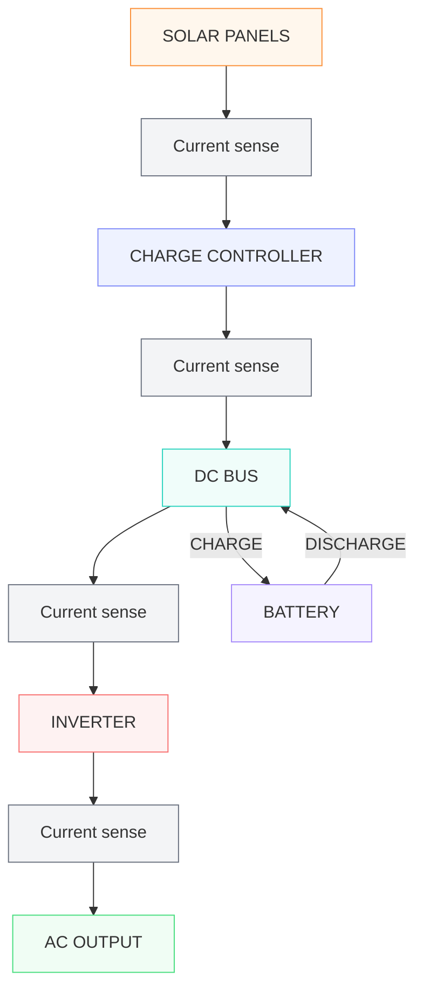

## MCU GPIO pin connections

 GPIO0: Connected high to 3v3 by a 10k resistor, then goes to a button that when pressed pulls the pin low to ground 

 GPIO1: Controls Q3 Mosfet through UCC27735DR IC

 GPIO2: Controls Q5 Mosfet through UCC27735DR IC

 GPIO3: Controls Q4 Mosfet through UCC27735DR IC

 GPIO4: Controls Q6 Mosfet through UCC27735DR IC

 GPIO5: RPM speed signal from NF-A4x20 5V PWM (GPIO5 is pulled up via a 10k resistor to 3v3 rail)

 GPIO6: PWM signal to NF-A4x20 5V PWM

 GPIO8: Connects to ADS7128IRTER SDA pin for serial data pulled up to 3v3 by 4.7k resistor

 GPIO9: Connects to ADS7128IRTER SCL pin for serial clock pulled up to 3v3 by 4.7k resistor

 GPIO11: Goes to a level shifter to get up to 5v then to a 330 ohm resistor then connects to string of ten WS2812B lights arranged next to each other from left to right with D1 starting and D10 finishing, the press button is to the left of D1

 GPIO26: Output of TMP235A2DBZR temp sensor located in the Control-Section

 GPIO27: Output of TMP235A2DBZR temp sensor located in the Inverter-Section 

---

## MUX AIN pin connections 

 AIN0: input rail voltage sensing, top resistor 36.5k, bottom resistor 10k, 47nF cap to ground on AIN pin  

 AIN1: output of 17v boost converter voltage sensing, top resistor 43.2k, bottom resistor 10k, 47nF cap to ground on AIN pin 

 AIN2: SW_A (Leg A of H bridge) voltage sensing, top resistor 45.3k, bottom resistor 10k, 47nF cap to ground on AIN pin

 AIN3: SW_B (Leg B of H bridge) voltage sensing, top resistor 45.3k, bottom resistor 10k, 47nF cap to ground on AIN pin 

 AIN4: Current sensing for source rail, 11-14v goes through 2m shunt, shunt is connected to INA240A2DR IC, the OUT pin of that IC goes to a 22 ohm resistor to AIN pin, the AIN pin has a 100nF cap to ground.

---

## H-bridge (Inversion-Section)

| H-bridge leg | High-side MOSFET | Low-side MOSFET | Gate driver | RP2354A control |
|---|---|---|---|---|
| Leg A | Q3 | Q5 | U5 | GPIO1 / GPIO2 |
| Leg B | Q4 | Q6 | U6 | GPIO3 / GPIO4 |

> **H-bridge switching:** Q3/Q5 and Q4/Q6 are the complementary MOSFET pairs for Leg A and Leg B respectively. Dead time must be implemented between the high-side and low-side devices of each leg to prevent shoot-through.

---

## Design constraints

 We are refraining from putting in a 5v USB output for the Lamoka1, this is because our 11-14v to 5v buck converter is designed for usage up to one amp. In future Lamoka models if a USB output (preferably USB-C) is established the buck converter would have to be beefed up, however it would be even better if we had a USB-C PD circuit in so the user could get a better experience around a wider range of usage. 

 The transformer applied to the Lamoka1 is five pounds and around $80, we understand this may be a strong downside to some people, however we found this was the best widely available option, plus it adds efficiency prospects. 

## Current sensing and energy flow chart 

## User interface board

Unfortunately, we had to create a whole separate board for the user interface due to how large the transformer is. Both boards will be attached with mouse bites so that they can be easily fabricated and assembled together, then you can simply break them apart when you receive them. The two boards will be attached by a five-pin wired connector allowing us to route in a heatsink and other airflow-aware design choices, instead of operating around ten RGBs and a button.