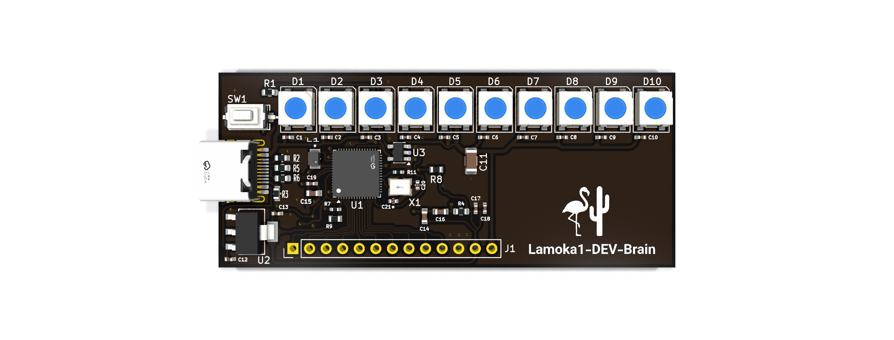

## Top priority
 

The DEV-Brain is an experimental board for testing the Lamoka1’s control and user interface concepts in a cheap and simple medium. More information can be found [here.](Lamoka1-DEV-Brain/Readme.md)

---

Would you like your very own Lamoka1-DEV-Brain to experiment on? Well, we have been working hard to make it easy for you.

**Here's our guide: [Click Me :)](Lamoka1-DEV-Brain/Here%20is%20a%20simple%20way%20to%20get%20a%20Dev-Brain)**

---

## Scope of Lamoka1

 The **Lamoka1** is a fully open-source, pure sine wave inverter and charger system, controlled by an RP2354A. It's designed to be fully transparent, modular, and repeatable, aiming to be the best in its class rather than a closed, disposable black box. Every schematic, every line of firmware, and every design decision is published — nothing is hidden behind proprietary lock-in.

It's designed for solar enthusiasts, electrical engineers, and everyday users alike, with a simple physical interface hiding a fully configurable system underneath.

---

## Notable features

-  **Pure sine wave output** — or virtually any waveform you want, up to a 180V peak limit
-  **Modular & repairable** — built from replaceable, well-documented sections instead of a sealed, disposable unit
-  **Fully configurable** — every behavior can be customized through user code, not locked behind firmware
-  **Adaptive cooling** — per-section temperature sensing drives a PWM-controlled fan, scaling speed precisely instead of crude on/off switching
-  **Minimal UI** — ten RGB LEDs and a single push button handle the entire physical interface

---

## Specifications for Charging

| Parameter          | Value                                      |
|--------------------|--------------------------------------------|
| **DC Input**       | 5–40 V                                     |
| **Battery Output** | 4S default, or configurable via MCU I2C |
| **Control**        | RP2354A microcontroller via I2C  |
| **User Interface** | 10× RGB LEDs + 1 push button |
| **Cooling**        | Pulse width modulated fan |

---

## Specifications for Inversion

| Parameter | Value |
|:---|:---|
| **DC Input** | 5–40V |
| **Inverter Output** | AC 120 Vrms or Configurable |
| **Control** | RP2354A microcontroller |
| **User Interface** | 10× RGB LEDs + 1 push button |
| **Cooling** | Pulse width modulated fan |

---

## Software-Defined Control

The entire Lamoka1 can be articulated by the RP2354A, from its charging methods, to its output waveforms on the inverter, your only limit is the hardware, which we are committed to improve on designs and ease of access. 

Out of the box, Lamoka1 comes with **basic stock firmware** For the inverter section that means: clean sine wave output and a resistive-load "dumb mode". This can be a starting point, not a limit of function. For the charging section that means: MPPT setup for charging 4S LIFEPO4 batteries. 

> [!TIP]
> Because the RP2354A controls operation directly, the unit can be reprogrammed to do far more than the stock firmware — custom waveforms, different control strategies, alternative protection logic, whatever you can get the math to do safely. This is where the open-source firmware license really matters: if you build something, you can share it back with the community, and anyone else with a Lamoka1 can run it.

---

## License

Lamoka1 uses a split license, matching the folder you're in:

- **Hardware**  — Licensed under [CERN-OHL-W v2.0](https://ohwr.org/cern_ohl_w_v2.txt)
- **Firmware**  — Licensed under [GPL v3.0](https://www.gnu.org/licenses/gpl-3.0.html)
---

## Lamoka project goals

We want anyone to be able to pick up any Lamoka unit, and use it for what they need. These units are designed to be reliable and usefull. We are giving the power back to the people. It is your power, you should get the freedom to control it how you see fit. 

## Lamoka1 caution 

The Lamoka1 is simply designed to be as cheap as possible while still being the MVP product, this is just so we can get people interested while maintaining funds to keep going. When ordering PCBs with design from the Lamoka1, please use your own best judgement for safety. 

---

---

## Questions or concerns? 

Contact Flamingo & Cactus (managing the Lamoka1) by email at: Flamingoncactusgroup@gmail.com

OR

Create an issue on this Github page
