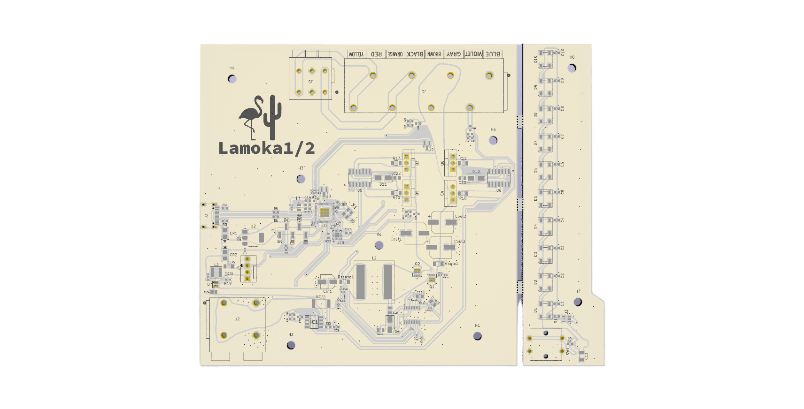

 

&nbsp;&nbsp;

---

## Owego Rotary craft fair 

 For the Owego Rotary craft fair, taking place at the Elks Lodge in Owego, NY, on November 14th from 9am to 3pm, the main project being presented by Flamingo and Cactus will be the Lamoka1/2, an inverter-only version of the Lamoka1. More details will be presented after the event. 

## What is the Lamoka1?

 The Lamoka1 is an open-source inverter/charger system designed for complete transparency and control. Unlike market alternatives that are locked-down black boxes, the Lamoka1 gives you full access to your power conversion. If you don't have technical experience, that's completely fine—our Portal Interface Engine (Lamoka's operating system) provides a solid stock setup. But if you want to get technical, feel free to customize and modify the unit however you like.

---

## Specifications 

 The Lamoka1 inverter section takes an 11V–14V input, steps it up to a 17V rail via the LM5122QMHX-NOPB boost converter, and feeds it into an H-bridge (four CSD19536KCS NMOSs driven by two UCC27735DR gate drivers) controlled by an RP2354A microcontroller—giving you total flexibility to program whatever waveform or output you need. From there, it passes into a VPT24-4170 transformer to step up the voltage.

 We use a Qualtek FAD1-04010BHLW11 fan powered from the 5V buck rail for cooling. GPIO5 and GPIO6 are unused, so the MCU provides no PWM speed control or tach feedback for the fan. The two TMP235A2DBZR temperature sensors are monitored by the system. Voltage and current monitoring is handled by the ADS7128IRTER multiplexer, the 5V rail by the TPS62160DSGR buck converter, and the user interface by ten WS2812B LEDs with a B3F-4055 button.

---

## Usage of AI in this repository 

This repository is checked, maintained, and updated by humans. The Lamoka series is neither “vibe coded” nor blindly applied. Thought, testing, engineering judgment, and practical experience go into every decision made throughout the project.

AI is used as a tool to help us bridge the gap between our current resources and the scale of what we want to accomplish. It may assist with research, development, documentation, and other aspects of the project, but its output is not treated as inherently correct. Human review, testing, and engineering judgment remain essential to the development process.

PIE OS is an exception in that a significant portion of its code was generated with the assistance of AI. However, it has been reviewed, tested extensively, and refined to meet the same standards we apply to the rest of our work.

At Flamingo and Cactus, our goal is to provide the best products, services, and experiences we can to as many people as possible. As a small team, there are limits to what we can accomplish on our own. We have very large dreams, and AI allows us to act as a much larger team without losing the human judgment and responsibility behind what we create.
 

---

